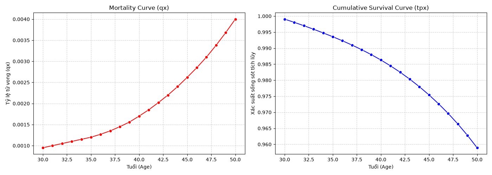
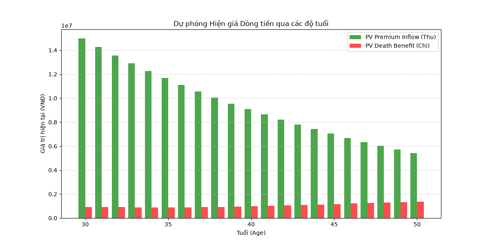
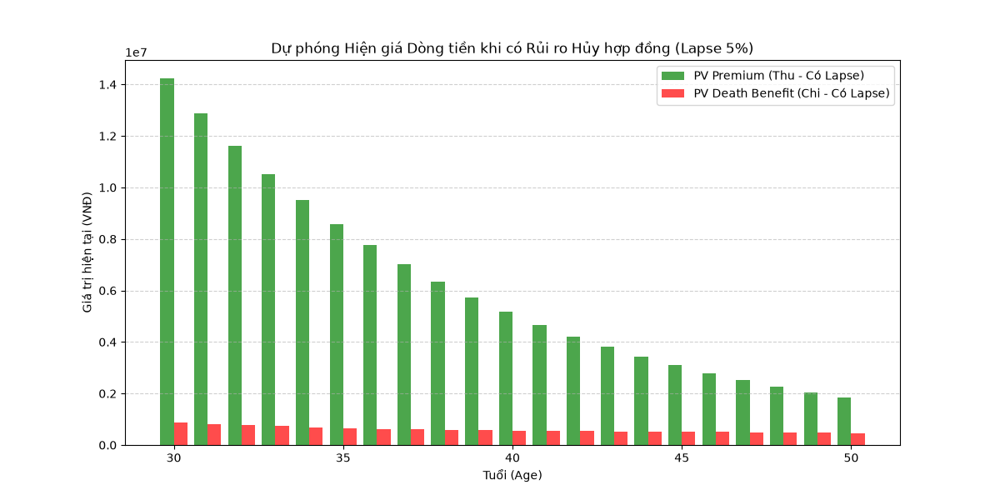

# Báo cáo Dự án: Life Insurance Cash Flow & Lapse Risk Projection

## 1. Mục tiêu Dự án
Mô phỏng một hợp đồng bảo hiểm nhân thọ tất định (Deterministic Model) nhằm xây dựng dự phóng dòng tiền và đánh giá tác động của rủi ro hủy hợp đồng (Lapse Risk) đến khả năng sinh lời.

## 2. Giả định Sản phẩm (Actuarial Assumptions)
*   **Tuổi tham gia (Issue Age):** 30 tuổi.
*   **Số tiền bảo hiểm (Sum Assured):** 1,000,000,000 VNĐ.
*   **Phí bảo hiểm (Annual Premium):** 15,000,000 VNĐ.
*   **Lãi suất đầu tư (Interest Rate):** 5%/năm.
*   **Tỷ lệ hủy hợp đồng (Lapse Rate):** 5%/năm.

## 3. Phân tích Tỷ lệ Tử vong (Mortality Analysis)
Xác suất một người ở độ tuổi $x$ sống sót qua $t$ năm tiếp theo (${}_t p_x$) được tính bằng tích của các xác suất sống từng năm ($p_x$):
$${}_t p_x = p_x \times p_{x+1} \times \dots \times p_{x+t-1}$$

## 4. Dự phóng Dòng tiền (Cash Flow Projection)
Dòng tiền được chiết khấu về giá trị hiện tại (PV) bằng hệ số chiết khấu $v = \frac{1}{1 + i}$. Ở mô hình tiêu chuẩn, lợi nhuận kỳ vọng đạt 177,321,132 VNĐ với biên lợi nhuận là 88.97%.

## 5. Phân tích Rủi ro Hủy hợp đồng (Lapse Risk Analysis)
Khi áp dụng giả định hủy hợp đồng 5%/năm, số lượng hợp đồng còn hiệu lực sụt giảm mạnh. 

Lợi nhuận tuyệt đối giảm xuống 117,443,576 VNĐ do mất đi nguồn thu phí từ những khách hàng rời bỏ hệ thống. Tuy nhiên, biên lợi nhuận lại tăng lên 90.34%. Nguyên nhân là do công ty giải phóng được phần lớn Trách nhiệm bồi thường (Liability) ở những năm cuối hợp đồng khi rủi ro tử vong $q_x$ tăng cao.

